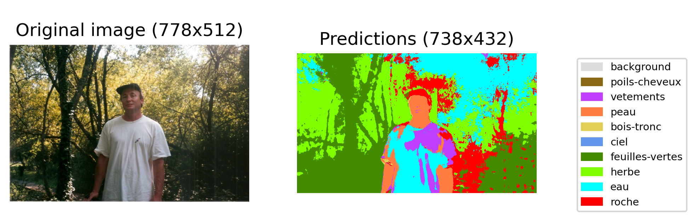

## AI & Painting

### Goal

This project aims at creating from scratch an AI pipeline designed to feed a robot with images and their classification maps, in order to assist a painter in his painting process 🎨

The AI algorithm solves a semantic segmentation problem, 
and produces a classification map like the one just below.



Note that the classification maps are far from perfect.
Admittedly, technical limitations are one of the causes.
But most importantly, the painter wanted to produce misclassifications 
in order to create an artistic effect for his paintings.
Also note that an UI tool was designed for him
to modify the previous classifications in various ways.

### Requirements
Clone this GitHub repository on your machine.
To install the appropriate environment, you will need a virtual environment manager, for example [Anaconda](https://docs.anaconda.com/anaconda/install/).
In your terminal, navigate to the cloned repository and execute the following command line to reproduce the environment used :

```
conda env create -f environment_lin.yml
```

If you're on Linux, use environment_lin.yml file. On Windows, use environment_win.yml.

Once you're done with the project, don't forget to remove the environment by running :

```
conda env remove -n ai-and-painting
```

### Getting started

The `main.py` script should be used both for training and predicting.

You can get some help on how to use it with : 
```
python main.py --help
```
It will display you the following help page : 

```
usage: main.py [-h] [--train] [--predict] [--light] [--note] [--patches-limit PATCHES_LIMIT] [--epochs EPOCHS] [--report REPORT] [--data-augment]

optional arguments:
  -h, --help            show this help message and exit
  --train, -t           Whether to create and train a new model.
  --predict, -pred      Whether to infer predictions on test images. Will ask the user a model path to use.
  --light, -l           Build a light report with image/predictions comparisons only. Should only be used with --predict.
  --note, -n            Add a note to the training report. Should only be used with --train.
  --patches-limit PATCHES_LIMIT, -pl PATCHES_LIMIT
                        Maximum number of patches to use for training. Should only be used with --train.
  --epochs EPOCHS, -e EPOCHS
                        Maximum number of epochs during training. Should only be used with --train.
  --report REPORT, -r REPORT
                        Report path to give the model to make the inference with. Should only be used with --predict.
  --data-augment, -da   Apply data augmentation on the training data. Should only be used with --train.

```

For example, for the training use case : 

```
python main.py --train --note --epochs 10 --data-augment
```

and for the predicting use case :

```
python main.py --predict --report <../training/report/path> --light
```

Note that `--train` and `--predict` options can be
specified at the same time in one command,
so that the predictions are made directly 
on the new trained model.


### Methodology

1. Creation of the dataset.

a. Download labels masks from LabelBox.

The PNG labels masks can be downloaded with the command :

python labelbox_utils/mask_downloader.py --json-path "<path_to_json>" --output-dir-path "<path_to_output_dir>"

b. Merge the masks together

c. Reorganize the masks folder structure.

d. Upload images with masks (images_utils).

e. stack image masks (save_all_categorical_masks)

### Limits

Of course, the project comes with its limits.
Here are some non-exhaustive leads to keep improving
the pipeline :

- track data augmentation more closely during training
- increase number of UNet encoder/decoder blocks
- track patches used for training with more detail (save used patches number, save minimized images...)